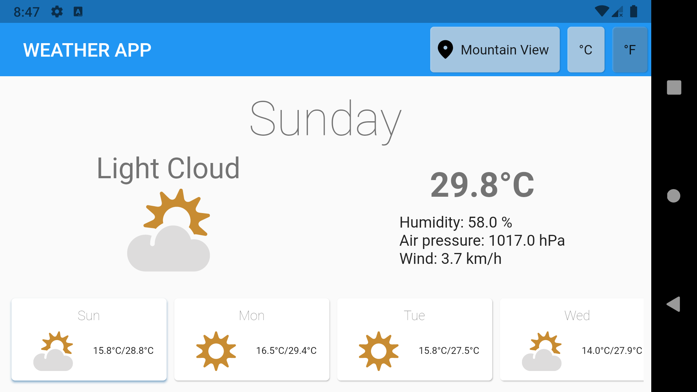

# weather_app
A weather app in Flutter based on metaweather API.
## Framework and architecture
- Based on Flutter 2.2 (Null safety)
- Based on MobX architecture
## Features
- Supports both portrait and landscape orientation
- Dynamic temperature unit change (C/F)
- Displaying weather SVG icon
- Location detection
- Location search (can display weather for chosen city)

APK file is in apk folder.

 

